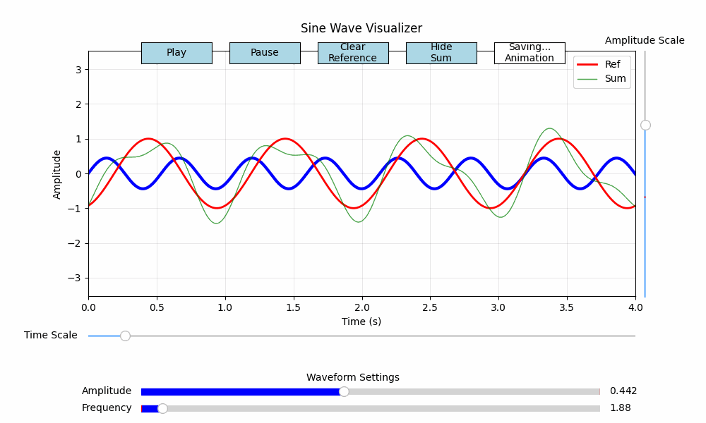
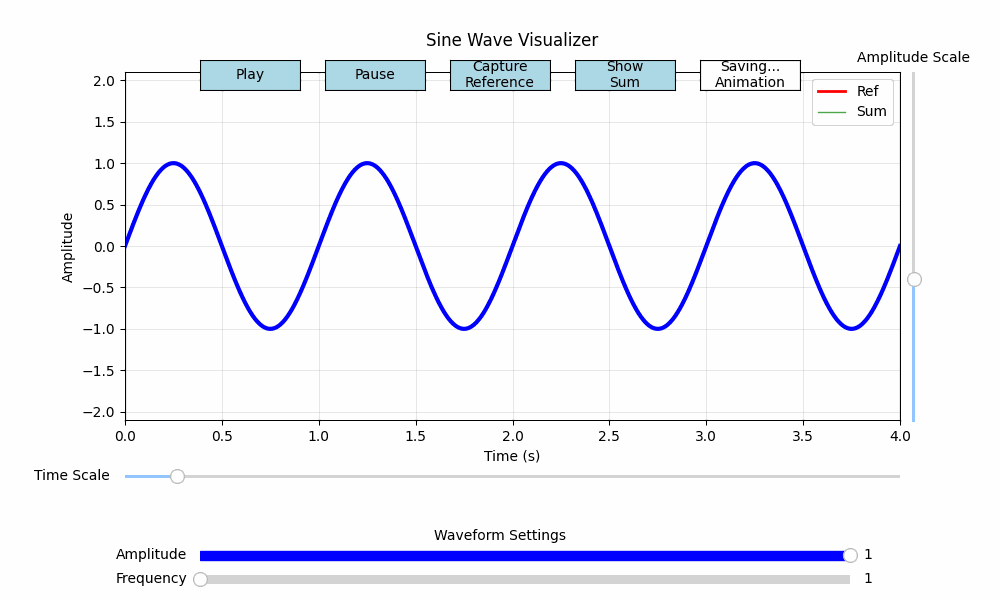
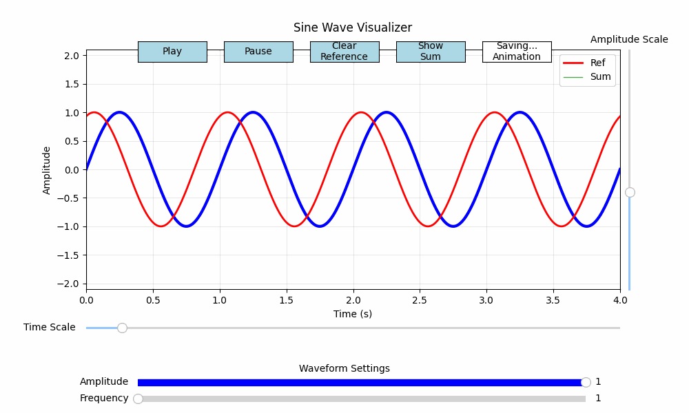
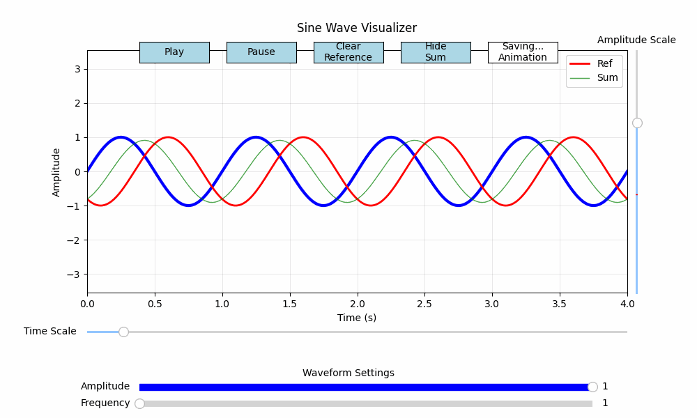

# PyWaves Visualizer
Teaching resource to allow experimenting with simple sine waves in an oscilloscope like enivronment



## Table of Contents
1. [Introduction](#introduction)
2. [Installation](#installation)
3. [User Settings](#user-settings)
4. [Scientific Explanation](#scientific-explanation)
5. [Known Issues and Future Improvements](#known-issues-and-future-improvements)
6. [Contact](#contact)
7. [License](#license)

## 1. Introduction <a name="introduction"></a>
PyWaves Visualizer is a Python script that allows users to visualize sine waves with different frequencies and amplitudes. The script provides a graphical interface where users can adjust various parameters and see the live animation of the sine wave. The animation can be played, paused, and saved as a GIF.



2. Reference Wave:
   Users can capture the current plot as a reference waveform by clicking the "Capture Reference" button. The reference wave is saved and displayed in red behind the animation.



3. Sum Wave (Optional):
   If the reference wave is captured, users can choose to show the sum between the live wave and the reference wave by clicking the "Show Sum" button. The sum wave is simply calculated as follows:
   `Sum(t) = LiveWave(t) + ReferenceWave(t)`
   and is displayed in green behind the animation.



By adjusting the frequncy and or amplitude of the wave, users can visulise the effect on the sum wave and investigate phase phenomena such as beating.


## 2. Installation <a name="installation"></a>
To setup PyWaves Visualizer, follow these steps:

1. Clone this repository to your local machine or download the script directly.
2. Ensure you have Python installed on your system (Python 3.6 or later recommended).
3. Install the required libraries using pip:

```bash
pip install numpy matplotlib
```

4. Run the `pywaves_visualizer.py` file.
3. The visualizer window will appear, and you can start experimenting with different sine waves.


## 3. User Settings <a name="user-settings"></a>
In the script, there are several user-configurable settings:

- `wave_fidelity`: Number of points to plot in the sine wave.
- `fps`: Frames per second of the animation (time between frames is 1/fps).
- `initial_frequency`: Initial frequency value in Hz.
- `initial_amplitude`: Initial amplitude value (normalized unitless).
- `initial_time_length`: Initial plot window length in seconds.
- `initial_amplitude_scale`: Initial amplitude scale value for y-axis.

Feel free to modify these settings according to your preferences.

## 4. Scientific Explanation <a name="scientific-explanation"></a>
The PyWaves Visualizer uses the following mathematical equations to generate the sine wave:

 General sine wave equation:
   `y(t) = A * sin(2 * π * f * (t - δ))`

   Where:
   - `A` is the amplitude of the wave.
   - `f` is the frequency of the wave in Hz.
   - `t` is time in seconds.
   - `π` is the mathematical constant pi (approximately 3.14159).
   - `δ` is the phase shift, which is set to 0 in this visualizer.


## 5. Known Issues and Future Improvements <a name="known-issues-and-future-improvements"></a>
The script currently has the following known issues and possible future improvements:

- [ ] Consider decoupling the time base and animation frame rate to address potential issues with beating due to animation mismatch.
- [ ] Add other waveforms like square, triangle, and sawtooth.
- [ ] Allow users to input slider values via keyboard input for precision and ease of use.
- [ ] Allow users to easily change slider limits.

## 6. Contact <a name="contact"></a>
If you have any questions, feedback, or issues related to PyWaves, feel free to contact me, Adill Al-Ashgar, at adillwmaa@gmail.co.uk.

## 7. License <a name="license"></a>
This project is licensed under the [MIT License](https://opensource.org/licenses/MIT). You are free to use, modify, and distribute the code for personal and commercial purposes. Attribution to the original author, Adill Al-Ashgar, is appreciated.

